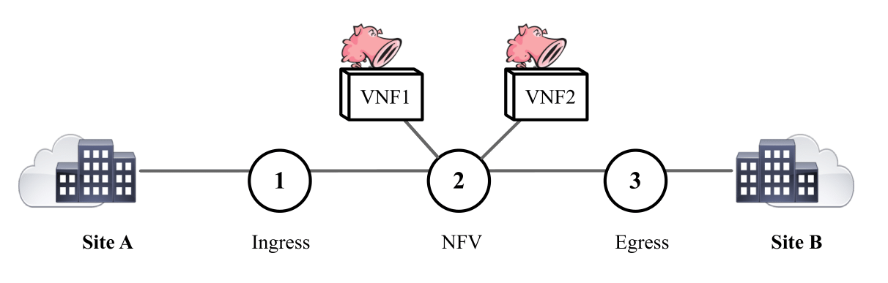

# SR-Snort: IPv6 Segment Routing Aware IDS/IPS
SR-Snort is an SR-aware Intrusion Detection System (IDS)/Intrusion Prevention System (IPS). It extends the open-source implementation of Snort, so it can apply snort rules directly to inner packet of SR encapsulated traffic. It supports inner IPv4 and IPv6 packets in both passive (IDS) and inline (IPS) modes.

## Design and Implementation 
The design and implementation of SR-Snort is available [here](http://netgroup.uniroma2.it/Stefano_Salsano/papers/18-sr-snort-demo.pdf). 

## Demo
The demo showcases the integration of SR-Snort in a SRv6 NFV Infrastructure deployed as a virtualized Linux environment.

### Topology 
The demo is deplyed on a simple network topology composed of three Linux nodes representing the Ingress, NFV, and Egress nodes of SRv6 domain. The Ingress node is configured with an SRv6 NFV policy to steer traffic from Site A towards Site B through VNF1 and VNF2, which results in having SRv6 encapsulated packets with an SRH containing segments for the two VNFs. Node 3 is configured with SRv6 decapsulation SID to remove the SRv6 encapsulation from packets as they leave the SRv6 domain. VNF1 and VNF2 run SR-Snort in IDS mode and IPS mode respectively.

The topology for the demo is as shown below:



### Deployment

We built our testbed using [virtualbox](https://www.vagrantup.com/downloads.html) as hypervisor and [vagrant](https://www.vagrantup.com/downloads.html) as VM manager. Please make sure that you have them installed on your machine.

Each node is deployed as a Virtual machine (VM) and running Linux kernel 4.14. VNF1 and VNF2 are deployed as Linux network namespaces in the NFV node.  Site A and Site B are deployed as Linux network namespaces in the Ingress and Egress nodes respectively. 

Clone the git repository in your machine: 

```
$ git clone https://github.com/SRouting/SR-Snort-demo
```

Deploy the testbed:

```
$ cd SR-Snort-demo/
$ vagrant up 
```

Using [iperf](https://iperf.fr/), we generate UDP traffic from Site A destined to Site with different destination port numbers (5000 and 6000 in this demo).

```
$ vagrant ssh ingress
$ sudo ip netns exec site_a iperf -V -u -c b::2 -p 5000 -l 1k -t 120 & 
$ sudo ip netns exec site_a iperf -V -u -c b::2 -p 6000 -l 1k -t 120 
```

VNF1 is configured with a snort rule to raise alert for UDP traffic that has destination port number of 5000. 

```
$ vagrant ssh nfv
$ sudo ip netns exec vnf1 cat /etc/snort/rules/local.ids.rule
  alert udp A::2 any -> B::2 5000 (msg:"ALERT !!! UDP packet src=A::2 dst=B::2 dport= 5000 "; sid:5000) 

$ sudo ip netns exec vnf1 snort -i veth0-vnf1 -c /etc/snort/snort.ids.conf -A console
 [**] [1:5000:0] ALERT !!! UDP packet src=A::2 dst=B::2 dport= 5000  [**] [Priority: 0] {UDP} a::2:42171 -> b::2:5000
 [**] [1:5000:0] ALERT !!! UDP packet src=A::2 dst=B::2 dport= 5000  [**] [Priority: 0] {UDP} a::2:42171 -> b::2:5000
```

VNF2 configured with a snort rule to drop UDP traffic that has destination port number of 6000. 

```
$ sudo ip netns exec vnf2 cat /etc/snort/rules/local.ips.rule
  drop udp A::2 any -> B::2 6000 (msg:"UDP packet src= A::2 dst=B::2 dport= 6000 "; sid:6000)
$ sudo ip netns exec vnf2 snort -c /etc/snort/snort.ips.conf -A console -Q
  [Drop] [**] [1:6000:0] UDP packet src= A::2 dst=B::2 dport= 6000  [**] [Priority: 0] {UDP} a::2:37740 -> b::2:6000
  [Drop] [**] [1:6000:0] UDP packet src= A::2 dst=B::2 dport= 6000  [**] [Priority: 0] {UDP} a::2:37740 -> b::2:6000
```
